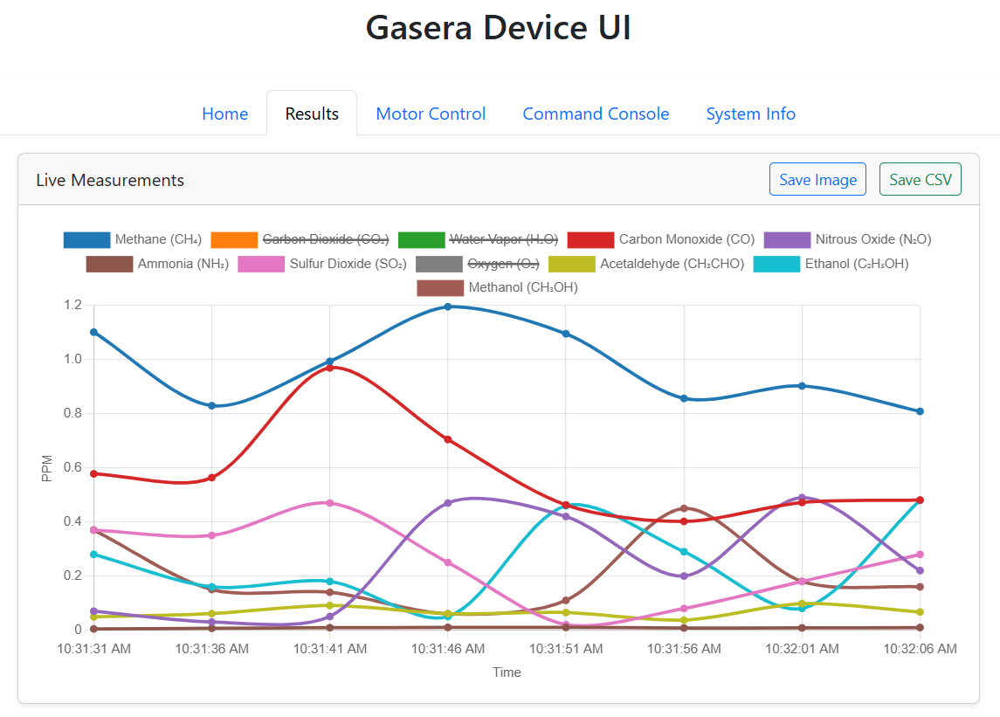

# GaseraWebUI

A web-based control panel and data viewer for Gasera ONE devices, built with Flask and Bootstrap. Designed for embedded systems and local deployment.

---

## 🚀 Features

- Real-time polling of Gasera device status
- Live gas concentration chart (Chart.js)
- Tab-based user interface (Status, Results, Motors, System Info, etc.)
- Simulated device responses (for development without hardware)
- Socket-based communication with Gasera ONE
- Modular Flask app with Blueprints (`/gasera`, `/system`, `/gpio`)

---

## 🖥️ Interface Preview

---

## 📦 Requirements

- Python 3.7+
- Flask
- Waitress (recommended for embedded/server use)

---

## 🧾 Supported Protocol Commands

Gasera ONE devices use a custom ASCII-based protocol (AK Protocol) with a set of request/response commands.

Each command returns either a:

- **Simple Response**: Just indicates success or error (e.g., `STAM 0`)
- **Extended Response**: Contains structured or readable data fields (e.g., `ACON 0 <timestamp> <CAS> <ppm>`)

Here’s the full list in protocol order:

| No. | Command | Description                             | Response Type  |
|-----|---------|-----------------------------------------|----------------|
| 1   | `ASTS`  | Ask Current Device Status               | Extended       |
| 2   | `AERR`  | Ask Active Errors                       | Extended       |
| 3   | `ATSK`  | Ask Task List                           | Extended       |
| 4   | `STAM`  | Start Measurement (by Task ID)          | Simple         |
| 5   | `STPM`  | Stop Current Measurement                | Simple         |
| 6   | `ACON`  | Get Last Measurement Results            | Extended       |
| 7   | `SCOR`  | Set Measurement Component Order         | Simple         |
| 8   | `SCON`  | Set Concentration Format                | Simple         |
| 9   | `AMST`  | Get Measurement Phase                   | Extended       |
| 10  | `ANAM`  | Get Device Name                         | Extended       |
| 11  | `STAT`  | Start Measurement (by Task Name)        | Simple         |
| 12  | `AITR`  | Get Current Iteration Number            | Extended       |
| 13  | `ANET`  | Get Network Settings                    | Extended       |
| 14  | `SNET`  | Set Network Settings                    | Simple         |
| 15  | `APAR`  | Get Parameter Value                     | Extended       |
| 16  | `SONL`  | Set Online Mode                         | Simple         |
| 17  | `ACLK`  | Get Device Date/Time                    | Extended       |
| 18  | `STUN`  | Set Laser Tuning Interval               | Simple         |
| 19  | `ATSP`  | Get Measurement Task Parameters         | Extended       |
| 20  | `ASYP`  | Get System Parameters                   | Extended       |
| 21  | `AMPS`  | Get Sampler Parameters                  | Extended       |
| 22  | `ADEV`  | Get Device Info                         | Extended       |
| 23  | `STST`  | Start Device Self-Test                  | Simple         |
| 24  | `ASTR`  | Get Self-Test Result                    | Extended       |
| 25  | `RDEV`  | Reboot Device                           | Simple         |

These commands are integrated into the backend logic via the `GaseraProtocol` and `GaseraController` classes.