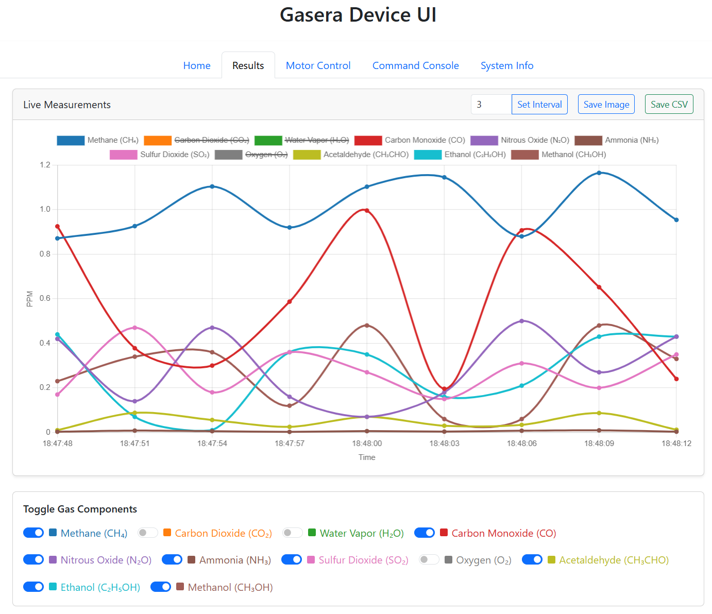

# GaseraWebUI

A web-based control panel and data viewer for Gasera ONE devices, built with Flask and Bootstrap. Designed for embedded systems and local deployment.

---

## 🚀 Features

- Real-time polling of Gasera device status
- Live gas concentration chart (Chart.js)
- Tab-based user interface (Status, Results, Motors, System Info, etc.)
- Simulated device responses (for development without hardware)
- Socket-based communication with Gasera ONE
- Modular Flask app with Blueprints (`/gasera`, `/system`, `/gpio`)

---

## 💻 Interface Preview



---

## 💽 OPiZ3 Hardware Wiring

### Motor Control via Relays
- Relay for Motor0 CW: `PC11`
- Relay for Motor0 CCW: `PH3`
- Relay for Motor1 CW: `PC14`
- Relay for Motor1 CCW: `PC15`

### User Buttons for Manual Motor Control
- BTN0 (Motor0 CW): `PC7`
- BTN1 (Motor0 CCW): `PH9`
- BTN2 (Motor1 CW): `PH6`
- BTN3 (Motor1 CCW): `PC10`

### Digital Inputs
- Limit Switch 0 (Motor0): `PI6`
- Limit Switch 1 (Motor1): `PC8` (`PI16` works on armbian image but it is marked as used in debian image)
- Trigger Input (to start/stop process): `PC1`

### Digital Output
- Buzzer control (via NPN transistor): `PH2`

### I2C Display
- I2C Clock (SCL): `PH4 (I2C3_SCK)`
- I2C Data (SDA): `PH5 (I2C3_Data)`

> Note: The LCD can be a character display or OLED (to be decided).

---

## 📆 Requirements

Below are the required packages for running GaseraWebUI on an Orange Pi Zero 3, with a short explanation for each:

- `nginx` — Reverse proxy server for forwarding requests to Flask app  
- `python3` — Main Python runtime
- `python3-pip` — Python package manager for installing any extras  
- `python3-flask` — Web framework used by the application  
- `python3-waitress` — Production WSGI server to run Flask app behind Nginx  
- `python3-netifaces` — Used for querying and managing network interfaces  
- `python3-psutil` — For system stats, process info, memory usage, etc.  
- `gpiod`, `python3-libgpiod` — GPIO access and control libraries for modern kernels (via libgpiod)  
- `git` — For cloning the application from GitHub  
- `network-manager` — Manages Wi-Fi and Ethernet connections  
- `hostapd` — Used if acting as a Wi-Fi access point (AP mode)  
- `dnsmasq` — Lightweight DNS/DHCP server (for AP mode)  
- `curl` — Command-line tool for HTTP requests (useful for testing or scripting)  
- `net-tools` — Classic tools like `ifconfig`, `netstat` (optional but handy)  
- `socat` — Multipurpose relay for serial, TCP/UDP, etc. (used in debugging or proxies)

---

## 📟 Supported Protocol Commands

Gasera ONE devices use a custom ASCII-based protocol (AK Protocol) with a set of request/response commands.

Each command returns either a:

- **Simple Response**: Just indicates success or error (e.g., `STAM 0`)
- **Extended Response**: Contains structured or readable data fields (e.g., `ACON 0 <timestamp> <CAS> <ppm>`)

Here’s the full list in protocol order:

| No. | Command | Description                      | Response Type |
| --- | ------- | -------------------------------- | ------------- |
| 1   | `ASTS`  | Ask Current Device Status        | Extended      |
| 2   | `AERR`  | Ask Active Errors                | Extended      |
| 3   | `ATSK`  | Ask Task List                    | Extended      |
| 4   | `STAM`  | Start Measurement (by Task ID)   | Simple        |
| 5   | `STPM`  | Stop Current Measurement         | Simple        |
| 6   | `ACON`  | Get Last Measurement Results     | Extended      |
| 7   | `SCOR`  | Set Measurement Component Order  | Simple        |
| 8   | `SCON`  | Set Concentration Format         | Simple        |
| 9   | `AMST`  | Get Measurement Phase            | Extended      |
| 10  | `ANAM`  | Get Device Name                  | Extended      |
| 11  | `STAT`  | Start Measurement (by Task Name) | Simple        |
| 12  | `AITR`  | Get Current Iteration Number     | Extended      |
| 13  | `ANET`  | Get Network Settings             | Extended      |
| 14  | `SNET`  | Set Network Settings             | Simple        |
| 15  | `APAR`  | Get Parameter Value              | Extended      |
| 16  | `SONL`  | Set Online Mode                  | Simple        |
| 17  | `ACLK`  | Get Device Date/Time             | Extended      |
| 18  | `STUN`  | Set Laser Tuning Interval        | Simple        |
| 19  | `ATSP`  | Get Measurement Task Parameters  | Extended      |
| 20  | `ASYP`  | Get System Parameters            | Extended      |
| 21  | `AMPS`  | Get Sampler Parameters           | Extended      |
| 22  | `ADEV`  | Get Device Info                  | Extended      |
| 23  | `STST`  | Start Device Self-Test           | Simple        |
| 24  | `ASTR`  | Get Self-Test Result             | Extended      |
| 25  | `RDEV`  | Reboot Device                    | Simple        |

These commands are integrated into the backend logic via the `GaseraProtocol` and `GaseraController` classes.

---

## 🚀 Installation

📄 See [OPiZ3 Setup Instructions](docs/opiz3_setup.md) for burning image to sd-card and more up to ssh connection.
📄 See [Network Setup Instructions](docs/network_setup.md) for Wi-Fi and Ethernet configuration.

### Option 1: Online Installation (Recommended)

Make sure your Orange Pi Zero 3 has internet access:

```bash
cd /opt/
sudo git clone https://github.com/msuzer/GaseraWebUI.git
cd GaseraWebUI/install
sudo chmod 744 *.sh
sudo ./deploy.sh
```

This will:

- Install required system and Python packages
- Clone the app into `/opt/GaseraWebUI`
- Configure GPIO permissions
- Set up Nginx and systemd service
- Start the Flask app using Waitress

---

### Option 2: Offline Installation (Pre-packaged Files)

If your device has no internet access, copy the `GaseraWebUI` folder to the target device manually, then:

```bash
cd install
sudo ./deploy.sh
```

Make sure the following files are included:

- `deploy.sh`
- `uninstall.sh`
- `gasera.service`
- `gasera.conf`
- `99-gpio.rules`

---

## 🧹 Uninstallation

To remove all installed files, configurations, and services:

```bash
cd install
sudo ./uninstall.sh
```

This will:

- Stop and remove the systemd service
- Remove `/opt/GaseraWebUI`
- Remove Nginx configuration
- Remove GPIO udev rules
- Uninstall Python packages like `waitress`, `flask`, and `psutil`
